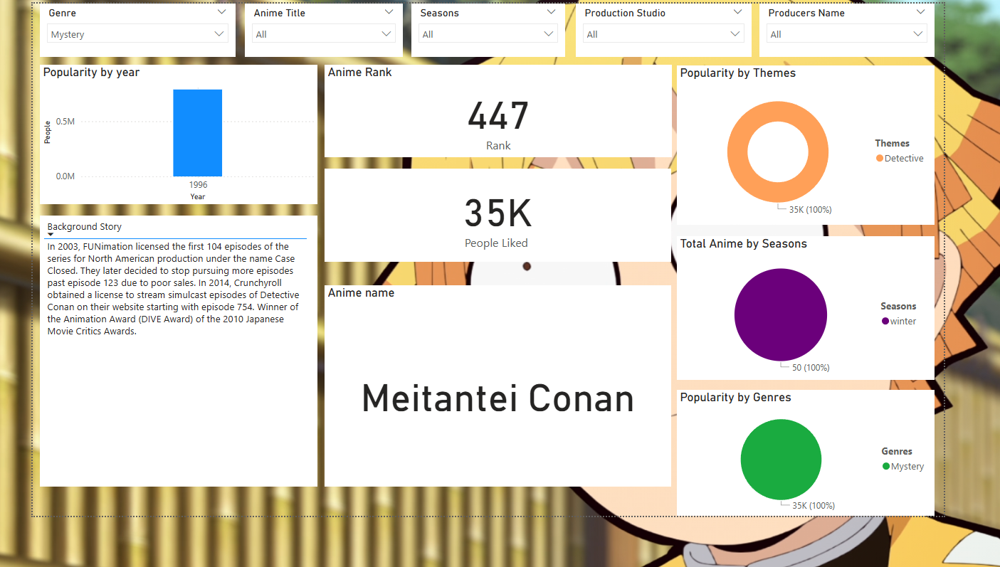

# 🎌 Power BI — Top Airing Anime Insights (Jikan API)

An interactive **Power BI** dashboard that visualizes the **Top Airing Anime** using the public **Jikan REST API**. It explores rankings, genres, studios, scores, popularity, and seasonal trends.

---

## 🔎 Highlights

- Top titles by **score**, **popularity**, and **members**
- Genre and studio **distributions** with cross-filtering
- Year/season breakdowns and KPIs
- Clean, mobile-friendly layout with slicers

---

## 📥 Data Source

- API: `https://api.jikan.moe/v4/top/anime?filter=airing`
- Ingestion: **Power Query (M)** inside Power BI (handles pagination)
- Optional: Python fetch script (future enhancement)

> Respect Jikan rate limits; refresh on demand rather than very frequently.

---

## 🧰 Tools

Power BI Desktop · Power Query (M) · DAX · Jikan API

---

## 🚀 Quickstart

1. **Download** the template from `report/`  
   - `report/CapstoneProjectAnime.pbit`
2. **Open** in Power BI Desktop
3. **Refresh** to pull latest data (or point to a curated CSV if you add one)
4. Explore the pages and slicers

> If your refresh is slow, limit pages of the API in your M query.

---

## 📸 Preview

| Overview | Genres |
|---|---|
|  |  |

> Add clean screenshots exported from Power BI (`File → Export → Image`) to `/screenshots`.

---

---

## 🔧 Future Improvements

- Add Python script to export curated CSV (and commit to `/data/curated/`)
- Publish to Power BI Service and share a public link (if allowed)
- Add measures list (DAX) and data model diagram
- Trend page for “airing now” vs historical seasons

---

## 🙌 Credits

- Data: **Jikan REST API** (community-maintained MyAnimeList API) → https://jikan.moe

---

## 🪪 License

MIT — feel free to reuse with attribution.
